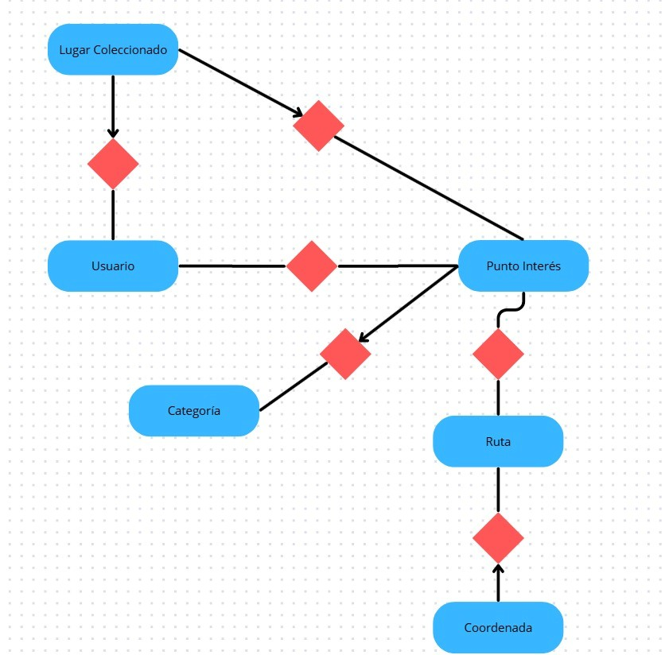

#  Plataforma Inteligente de Exploración y Planificación de Rutas Eco-turísticas.

## Desarrollo Basado En Plataformas

## Intgerantes: 
## - Huertos Ochoa Rodrigo Franco Código: 202510118
## - José Rodrigo Valdiviezo Ortiz Código: 202510135
## - Antonio Jorge Guerrero Cedrón Código: 202510717
## - Francesco Aroldo Ferrante Quino Código: 202510174
## - Ernesto Yen Mendoza Aguilar Código: 202510307

# Índice

# 1.  Introducción

## 1.1 Contexto:

En los últimos años, muchas personas que viven en ciudades han mostrado interés por realizar actividades al aire libre como el trekking y el ecoturismo, buscando reducir el estrés y mejorar su bienestar físico y mental.
Sin embargo, a pesar de este interés, existe una falta de información centralizada sobre rutas, logística, seguridad y puntos de interés cercanos, lo que dificulta la planificación de estas experiencias.
Además, muchos viajeros no logran descubrir ni aprovechar completamente los atractivos locales disponibles alrededor de las rutas, como restaurantes típicos, hospedajes, artesanías y sitios culturales. 
Esto genera experiencias incompletas tanto para los usuarios como para las comunidades locales que podrían beneficiarse del turismo.
Frente a esta situación, surge la necesidad de una herramienta digital que facilite la organización de rutas de trekking y que, al mismo tiempo, incentive la exploración de los puntos de interés cercanos mediante una experiencia interactiva y motivadora.

## 1.2 Objetivos: 

- Desarrollar una aplicación web de planificación de rutas de trekking que permita a los usuarios descubrir rutas naturales, organizar recorridos personalizados y explorar puntos de interés cercanos, incentivando la actividad física y el turismo local mediante un sistema de colección y recompensas digitales.
- Implementar un sistema de búsqueda y filtrado de rutas según dificultad, distancia y tipo de paisaje.
- Integrar puntos de interés relacionados con gastronomía, hospedaje, artesanías y atractivos turísticos cercanos a cada ruta.
- Permitir que los usuarios creen y guarden planificaciones de viaje personalizadas.
- Desarrollar un álbum digital donde los usuarios puedan coleccionar lugares visitados mediante geolocalización.
- Implementar un sistema de retos y recompensas que motive a los usuarios a completar rutas y explorar nuevos destinos.
- Utilizar servicios externos como Google Maps API, JWT y Cloudinary para mejorar la experiencia, seguridad y almacenamiento del sistema.
- Diseñar una interfaz intuitiva y accesible que facilite la navegación y el uso de la plataforma.
- Aplicar buenas prácticas de desarrollo backend y manejo de bases de datos usando Spring Boot y JPA.

# 2. Identificación del problema

## 2.1 Descripción del probelma: 

Las personas con estilos de vida sedentarios en entornos urbanos desean realizar trekking y
conectarse con la naturaleza; sin embargo, no ejecutan sus planes debido al desconocimiento
logístico y a la desilusión de no aprovechar al máximo los atractivos locales (gastronomía,
hospedaje, artesanías) cercanos a las rutas

## 2.2 Justificación: 

Para mejorar la experiencia de las personas senderistas que desean explorar distintas zonas del país mientras conocen su cultura, gastronomía y atractivos turísticos.
La aplicación permitirá a los usuarios orientarse de manera más eficiente en lugares nuevos, así como planificar adecuadamente los recorridos y objetivos que desean alcanzar durante sus trayectos.

# 3. Solución:

## 3.1 Funcionalidades Implementadas: 

Funcionalidades generales
A continuación se listan las funcionalidades más importantes que un usuario podrá realizar dentro
de la aplicación:
• Búsqueda de rutas con filtros de dificultad y tipo de paisaje.  (Conocer el entorno y los lugares por visitar incluido con sus dificultades)
• Recomendación de gastronomía, hoteles y artesanías según la ruta seleccionada.  (Conocer lo mejor y recomendable de cada lugar)
• Guardado de rutas con paradas específicas elegidas por el usuario.  (Conocer las preferencias del usuario y una mejor planificación futura)
• Álbum digital donde se guardan y coleccionan los lugares importantes una vez que el usuario 
llega físicamente a ellos.  (Conocer los lugares destacados y su descricpión para una mejor experiencia)
• Recompensas visuales por completar retos (por ejemplo: “Primera ruta de 5 km”,  
“Explorador de Cascadas”). (Animar al senderista a continuar con su camino y conocer loslugares)
• Visualización de la planificación y del progreso de la colección sin conexión a internet. (Para zonas que no llega una señal de internet)

## 3.1 Tecnologías Utilizadas: 

• Google Maps API: Para mostrar mapas, ubicaciones y apoyar en la visualización de rutas
y puntos de interés cercanos.
• Spring Security (con JWT): Para la gestión de autenticación, autorización y protección
de los endpoints de nuestra API, asegurando el registro e inicio de sesión de los usuarios.
• Cloudinary: Para el almacenamiento, optimización y entrega rápida de las imágenes de las
rutas, lugares y recompensas visuales.

# 4. Modelo de Entidades:

## 4.1 Diagrama :

## 4.2 Descripción de Entidades: 
- Entidad User

Atributos: id (identificador), nombre, email, password, rol.

Describe al usuario y tiene relación con la Entidad  Lugar Coleccionado de uno a muchos.

- Entidad Ruta

Atributos: id (identificador), nombre, latitudCentro, longitudCentro, dificultad(tipo de dificultad), tipoPaisaje (tipo de Paisaje).

Describe la ruta y tiene relación con la entidad Coordenada de uno a muchos y con la Entidad Punto de Interés de muchos a muchos.

- Entidad Punto Interés

Atributos: id (identificador), nombre, descripción, latitud, longitud, urlImagen.

Describe el punto por recorrer o interesado y tiene relación con la entidad Categoría de muchos a uno, con la Entidad Rutas de muchos a muchos y con la entidad Lugar coleccionado de uno a muchos.

- Entidad Lugar coleccionado

Atributos: id (identificado), fecha (fecha donde se guardo el punto), latitudchekin (laltitud del lugar), longitudchekin (longitud del lugar).

Descubre los lugares coleccionados por el usuario, tiene relación con la entidad Usuario de muchos a uno y con la Relación Punto de Interés de muchos a uno.

- Entidad Coordenada

Atributos: id(identificador), latitud, longitud, orden.

Describe las coordenadas del lugar, tiene relación con la Entidad Ruta de muchos a uno.

- Entidad categoría

Atributos: id (identificador), nombre.

Describe la categoría que tiene un lugar y tiene relación de uno a mucho con la entidad Punto de Interés

# 5. Testting y Manejo de Errores:
## 5.1 Niveles de textting realizados:
## 5.2 Resultados:
## 5.3 Manejo de errores: 

Se usan expeciones globales para capturar los erroes posibles en las peticiones. Esto ayuda a manejar problemas como
la authenticación del usuario, si existe o no, si no existe el usuario, El uso de sus credenciales. También se usa una excepción para poder 
corrobar si encotnró con el api de Gogle Places.

# 6. Medidas de Seguridad
## 6.1 Seguridad de Datos:

-  Autenticación mediante JWT (JSON Web Token):
El sistema utiliza tokens JWT para validar la identidad de los usuarios autenticados y proteger el acceso a los endpoints privados de la aplicación. Esto permite mantener sesiones seguras y evitar accesos no autorizados.

- Encriptación de contraseñas con BCrypt:
Las contraseñas de los usuarios no se almacenan en texto plano, sino cifradas mediante el algoritmo BCrypt, aumentando la seguridad frente a filtraciones de datos.

- Gestión de permisos y autorización:
Se implementan roles y restricciones de acceso para controlar qué usuarios pueden acceder a determinados endpoints, por ejemplo, la creación o modificación de rutas restringida a administradores.

- Filtros de seguridad en Spring Security:
Se utilizarán filtros que interceptan las peticiones entrantes para validar tokens, autenticar usuarios y manejar excepciones de seguridad como errores 401 (Unauthorized) y 403 (Forbidden).

- Almacenamiento seguro de imágenes:
Las imágenes de rutas y puntos de interés serán almacenadas mediante servicios externos como Cloudinary o Supabase Storage, evitando manejar archivos sensibles directamente en el servidor principal.

## 6.2 Prevención de Vulnerabilidades:
- Prevención de Inyección SQL:
Se empleará JPA Specifications y consultas parametrizadas mediante Spring Data JPA, evitando construir consultas SQL manualmente y reduciendo el riesgo de inyección SQL.

- Protección contra XSS (Cross-Site Scripting):
Se validarán y sanitizarán los datos ingresados por los usuarios antes de mostrarlos en la interfaz, evitando la ejecución de scripts maliciosos.

- Protección contra CSRF (Cross-Site Request Forgery):
Al utilizar autenticación basada en JWT y endpoints protegidos mediante tokens, se disminuye el riesgo de ataques CSRF sobre las sesiones de usuario.

- Validación de datos de entrada:
Todos los datos recibidos desde formularios y peticiones HTTP serán validados tanto en frontend como backend para evitar entradas inválidas o maliciosas.

- Control de acceso a endpoints:
Los endpoints sensibles requieren autenticación previa y verificación de permisos antes de permitir operaciones críticas como creación, edición o eliminación de información.

# 7. Eventos y asincronia
## 7.1 Eventos:

# 8. GitHub & Management
# 9. Conlusión:
## 9.1 Logros del Proyecto: 

El proyecto logró plantear una solución innovadora al problema de las personas que desean realizar actividades de trekking, pero que muchas veces no lo hacen debido al desconocimiento logístico y la falta de información sobre rutas y atractivos cercanos.
Además, se consiguió diseñar un sistema integral capaz de combinar planificación de rutas, puntos de interés, recomendaciones turísticas y elementos de gamificación dentro de una sola plataforma.
También se desarrollaron funcionalidades importantes del MVP como el buscador de rutas, el guardado de itinerarios y el sistema de colección de lugares visitados. Asimismo, se implementó un sistema de autenticación y seguridad mediante Spring Security y JWT para proteger la información de los usuarios y restringir el acceso a ciertos endpoints.
Otro logro importante fue la integración de servicios externos como Google Maps API y servicios de almacenamiento multimedia en la nube, lo cual permitió mejorar la experiencia del usuario y ampliar las capacidades del sistema.

## 9.2 Aprendizajes Clave:

Durante el desarrollo del proyecto se obtuvieron importantes aprendizajes técnicos y organizativos. El equipo aprendió sobre el desarrollo de APIs REST utilizando Spring Boot y sobre la implementación de sistemas de autenticación y autorización mediante JWT y BCrypt.
También se adquirieron conocimientos relacionados con la integración de APIs externas y  el manejo de datos geográficos . Se comprendió mejor la importancia de la seguridad en aplicaciones web y la validación de datos para prevenir vulnerabilidades comunes. 
Además, el proyecto permitió fortalecer habilidades de trabajo en equipo, organización modular del backend y coordinación entre distintos módulos dependientes entre sí. Finalmente, se aprendió a utilizar un enfoque API First y DTOs para facilitar el desarrollo paralelo y evitar bloqueos entre integrantes del equipo.

## 9.3 Trabajo Futuro: 

Como trabajo futuro, el proyecto podría incorporar recomendaciones inteligentes según las preferencias del usuario, funcionalidades sociales para compartir rutas y logros, además de mejoras en la gamificación y soporte sin conexión. 
También se plantea desarrollar una aplicación móvil y añadir notificaciones en tiempo real para mejorar la experiencia del usuario.
